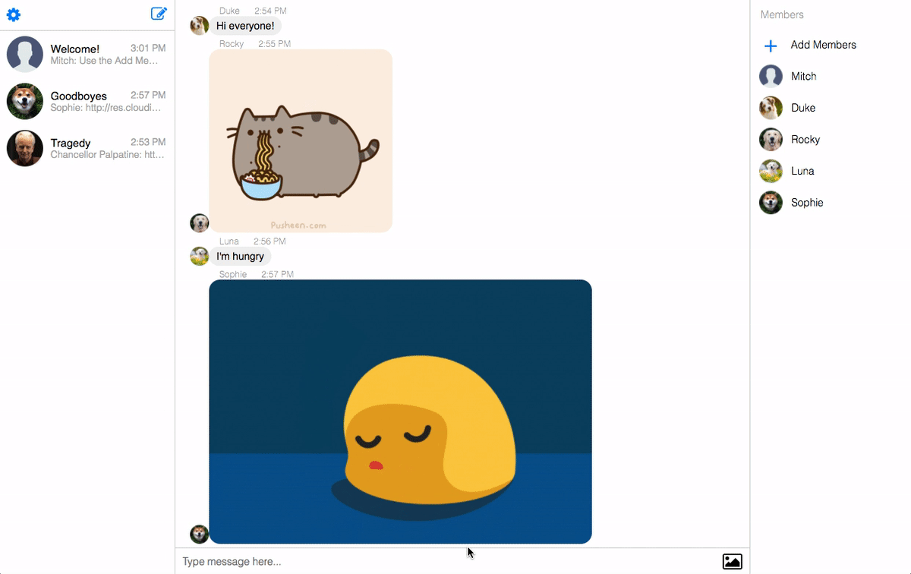
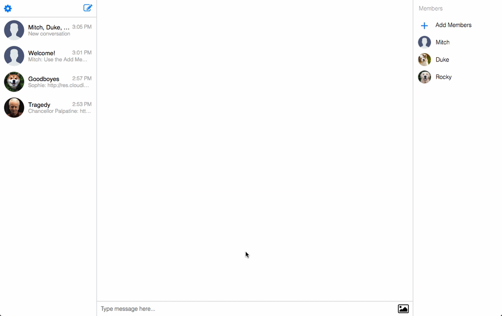

# Message-Me!
https://message-me.live

Message-Me is an instant messaging client based on the popular Messenger application by Facebook. It uses a React/Redux frontend connected to a Ruby on Rails server, with a PostgreSQL database.


## Live Chat

Users can send and receive messages in real time using Rails 5 Action Cable to create socket connections.


**Instant Message Delivery**

Upon hitting return, a message is send to the database through an AJAX request, where it is saved and passed along to Action Cable and broadcasted to the appropriate conversation. Users connected to the same conversation will have their page automatically updated.

The MessageRelayJob directs the saved message to the correct channel.

```
class MessageRelayJob < ApplicationJob
  def perform(message, conversation)
    message = Api::MessagesController.render(
      partial: 'api/messages/message',
      locals: { message: message }
    )
    ActionCable.server.broadcast("channel_#{conversation.id}",
                                 message: JSON.parse(message))
  end
end
```


## Image Sending

Users can also send and receive images in real time via Cloudinary's upload widget and API.


## Profile Picture Uploading

Image uploading is also available for setting custom profile pictures.


## Creating Conversations

Users can search for other users to create a new conversation with.



**Creating a conversation**

Users can start a direct conversation with multiple other users using the Create Conversation button. This opens a new conversation form, which when submitted redirects to the newly created conversation.

The conversation controller in the Rails backend creates ConversationMembership models for both the current user and the users they're starting a conversation with.


## Adding New Members to a Conversation

Users can search for and add members to a conversation.



Users can hold a conversation with multiple other users.

**Adding Members to a Conversation**

Users can add new members to an existing conversation that they belong to. The new users are automatically added to the members list and will now be able to see this new conversation in their navigation bar and access it. Multiple members can be added at one time. The backend creates a ConversationMembership for each user being added to the conversation, but only if they are not already a member.


## User Authentication

Users can sign in, sign out, register, and create a guest account

**Encryption**

Message-Me requires users register with an unique email, and encrypts the password using `Bcrypt` before saving it to the database.

```
class User < ApplicationRecord
  # ...
  def password=(password)
    @password = password
    self.password_digest = BCrypt::Password.create(password)
  end

  def is_password?(password)
    BCrypt::Password.new(self.password_digest).is_password?(password)
  end
  # ...
end
```

**Secure Persistent State**

Users remain signed in until logout by generating and delivering a unique session token to the user as a cookie on every login. The token is saved to the database and compared with the user's token to maintain their login status.

```
class User < ApplicationRecord
  # ...
    def generate_unique_session_token
      self.session_token = new_session_token
      while User.find_by(session_token: self.session_token)
        self.session_token = new_session_token
      end
      self.session_token
    end

    def new_session_token
      SecureRandom.urlsafe_base64
    end
  # ...
```

## User Search

Users can search for other users when using the add members function. A list of up to 5 users will be displayed with names matching the search input. The matches are updated for each keystroke. Clicking returned results adds them to a list of users to be added. Hitting return in the search field sends a request to add all selected users to the current conversation.
